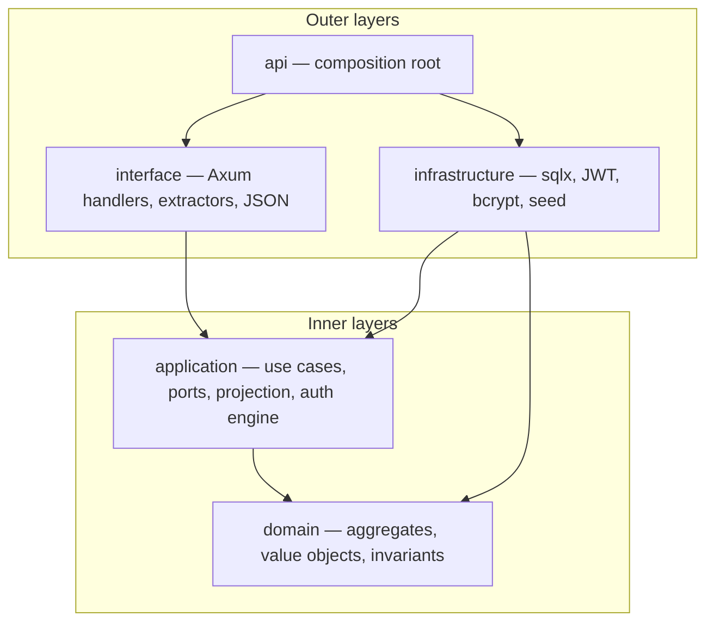

# Clean Architecture & authorization guidelines

Canonical reference for the GeoSyntra Rust migration (Tasks 0+).  
Express remains production on `main` until **Task 27 cutover**; these rules govern the Axum stack on `feature/axum-migration`.

---

## Layer dependency rule



| Layer | May depend on | Must not depend on |
|-------|---------------|-------------------|
| **domain** | std + minimal crates | application, infrastructure, interface, api |
| **application** | domain | infrastructure, interface, axum, sqlx |
| **infrastructure** | application ports + domain (mapping) | interface, api |
| **interface** | application DTOs + use cases | sqlx directly (use ports) |
| **api** | all crates | — (wires DI only) |

**Pragmatic note:** Infrastructure may import domain types for row mapping. Prefer application DTOs at repository boundaries when adding new adapters.

---

## Request pipeline (target)

```text
HTTP request
  → interface: extract SubjectContext + Environment from JWT
  → use case: authorize (phase 1) → business logic → project (phase 2)
  → interface: map *View → JSON
```

Every RBAC-gated endpoint flows through a **named use case** implementing `UseCaseDescriptor`.

---

## Authorization: three orthogonal checks

Do not conflate these — Express separates them today:

| Check | Mechanism | Layer | Example |
|-------|-----------|-------|---------|
| **RBAC** | Role → permission (`Resource` + `Action`) | Application `SubjectContext` + `RbacPermissionPolicy` | `admin.users.read` |
| **ABAC** | Stored policies + subject/resource attributes + relations | Application `ApplicationStoredPolicy` + engine | Tenant env, custom deny rules |
| **Billing / plan** | Subscription + tenant feature flags + quota | Domain `TenantFeatureConfig::evaluate` | `GeoFeature::AiQuery` daily limit |

GeoAI endpoints require **RBAC** (`ai.run`) **and** **billing gate** (`GeoFeature::AiQuery`).  
See [billing-rbac-bridge.md](./billing-rbac-bridge.md).

---

## Two-phase authorization (application)

### Phase 1 — Action (can invoke use case?)

```rust
authorize_use_case::<U>(auth, &params)?;  // AuthorizationEngine → Allow/Deny
```

- Input: `SubjectContext`, `Environment`, optional `AuthorizationParams` (tenant_id, target_user_id).
- Maps `U::RESOURCE` + `U::ACTION` → domain permission via `rbac_mapping.rs`.
- Policies (in order):
  1. Guard policies (hard denies)
  2. Dynamic policies (`TenantIsolationPolicy`, stored ABAC)
  3. RBAC fallback (`RbacPermissionPolicy`)
  4. Default **Deny**

### Phase 2 — Field (which columns/JSON keys?)

```rust
let access = authorize_use_case_with_fields::<U, UserField>(auth, &params, readable_user_fields)?;
let view = UserProjector::present(partial, &access);
```

- **Read:** `readable_*_fields` derives allowed fields from subject permissions + self-read (M3).
- **Write:** `writable_fields` (not yet implemented — commands validated at aggregate level today).
- Projectors zero denied fields to `None` — single `UserView` type, no `*Privilege` tiers.

**Self-read (M3):** When `AuthorizationParams.target_user_id == subject.user_id()`, grant
profile/detail fields without requiring `admin_users.read`. Security fields still require manage/admin.

---

## RBAC model

| Concept | Location | Notes |
|---------|----------|-------|
| Express slugs | DB `rbac_permissions.slug` | 17 slugs; see [permission-slug-matrix.md](./permission-slug-matrix.md) |
| Domain permission | `Permission { Resource, Action }` | Parsed from slug at infra boundary |
| Roles | DB `rbac_roles` + static MATRIX seed | **Target:** runtime load via `RoleRepository` |
| Subject permissions | `SubjectContext::has_permission` | Union of role permissions + valid temporary grants |
| Use-case mapping | `rbac_mapping.rs` | Maps descriptor strings → domain pairs |

JWT carries **`roleSlug` only** — not permission slugs. See [jwt-role-membership-bridge.md](./jwt-role-membership-bridge.md).

---

## ABAC model (stored policies)

| Concept | Location |
|---------|----------|
| Versioned policy sets | `authorization_policy_versions` + `authorization_policies` tables |
| Port | `PolicyRepository` — CRUD + `load_active_policies` |
| Runtime policy | `ApplicationStoredPolicy` — matches resource type, action, relations, attributes |
| Composition | Task 15: `load_active_policies` → `AuthorizationEngine::with_stored_policies` |

**Engine order (Task 11 ✅):** tenant isolation → stored ABAC (priority desc) → RBAC fallback → deny. C1 fixed — stored policies are reachable.

ABAC attributes are populated on `AuthorizationParams` via use cases (`with_resource_tenant_id`, etc.) and `Environment` (time, network, device posture).

---

## Projection pattern

| Rule | Detail |
|------|--------|
| Output type | One `*View` per entity (`UserView`, `RoleView`, …) |
| Partial load | SQL/repos return `Option` per field |
| Access control | `AccessControl<FieldEnum>` from phase-2 auth |
| Projector | `EntityProjector::present(partial, &access)` → `apply_access` |
| Commands | `*Command` DTOs → domain transitions → write repos |

**Anti-patterns (removed Task 6b):**

- ❌ `GetUserBasicUseCase` / `GetUserAdminUseCase` tier duplication
- ❌ `FieldProfile` / `*Privilege` use-case naming
- ❌ Returning domain aggregates as API JSON

Full DTO rules: [`packages/application/src/dto/PATTERN.md`](../packages/application/src/dto/PATTERN.md).

---

## Persistence boundary (permissions)

Store **Express slug strings** in PostgreSQL; map to domain at load:

```text
DB slug → PermissionSlug::new → to_resource_action() → Permission { resource, action }
```

Actual Task 10 schema uses `rbac_permissions`, `rbac_roles`, `rbac_role_permissions` (TEXT keys, tenant-scoped role ids). See [persistence-permission-boundary.md](./persistence-permission-boundary.md).

Do **not** persist derived `resource`/`action` columns as a second source of truth.

---

## Tenant isolation

`TenantIsolationPolicy` denies when `resource_attributes["tenant_id"] != subject.tenant_id()`.

- **Task 7:** Use cases call `with_resource_tenant_id`.
- **Task 12:** Handlers set resource tenant from loaded entity (H2 full).

If `tenant_id` attribute is unset, isolation policy is inert (allows) — handlers must set it.

---

## Policy engine evaluation (intended — Task 11 ✅)

```text
1. guard_policies (immutable hard rules)
2. dynamic_policies (TenantIsolationPolicy, test AllowAll)
3. stored_policies sorted by priority (desc) — ABAC
4. RbacPermissionPolicy (Express role permissions fallback)
5. default Deny
```

Runtime DB policy load: Task 15 composition root (`load_active_policies`).

---

## Testing requirements

- Every behavior change → test in same commit ([`.cursor/rules/test-with-every-change.mdc`](../.cursor/rules/test-with-every-change.mdc))
- Slug matrix: 17/17 in domain tests
- RBAC mapping: unit tests in `rbac_mapping.rs`
- Infra Postgres: `#[ignore]` integration tests with `DATABASE_URL`
- Task 16: golden parity Axum vs Express

---

## Related docs

| Doc | Topic |
|-----|-------|
| [rbac-use-case-mapping.md](./rbac-use-case-mapping.md) | Use case → Express permission |
| [permission-slug-matrix.md](./permission-slug-matrix.md) | 17 slugs |
| [role-permission-matrix.md](./role-permission-matrix.md) | 8 roles × permissions seed |
| [jwt-role-membership-bridge.md](./jwt-role-membership-bridge.md) | JWT → SubjectContext |
| [billing-rbac-bridge.md](./billing-rbac-bridge.md) | Plan gates vs permissions |
| [pre-task-audit-11.md](./pre-task-audit-11.md) | Latest audit (Tasks 0–11) |
