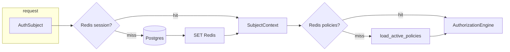

# Redis auth & session cache (Task 23.6)

**Goal:** Add **Redis** as a shared cache layer to cut Postgres round-trips on the **hot auth path** (every `AuthSubject` request) and other read-heavy tenant/role data — without weakening tenant isolation or permission correctness.

**Prerequisite:** [Task 23.5 access control](./dioxus-access-control-plan.md) (tenant-scoped session model).

**Index:** [dioxus-axum-plan.md](./dioxus-axum-plan.md) · [rbac-use-case-mapping.md](./rbac-use-case-mapping.md)

---

## Problem today

Every authenticated Axum request runs:

```text
AuthSubject extractor
  → JwtSubjectContextResolver.resolve()     # JWT verify + SQL: memberships + N× role_permissions
  → ReloadableAuthorizationService.ensure_loaded()  # SQL: load_active_policies (in-memory fingerprint cache only)
```

| Issue | Impact |
|-------|--------|
| **Per-request SQL** for membership + roles | Latency on dashboard/admin/settings (many parallel API calls from Dioxus) |
| **In-memory policy cache** only | Lost on restart; **not shared** across API replicas on VPS |
| **No session snapshot cache** | `/api/rbac/me` and each handler re-resolve roles from DB |
| **Dioxus wasm** | Hydration + page load triggers multiple `/api/*` calls → multiplies SQL |

Target: **cache hit on auth path &lt; 2 ms**; Postgres only on miss or invalidation.

---

## Cache layers

| Key pattern | Value | TTL | Invalidated when |
|-------------|-------|-----|------------------|
| `gs:session:{user_id}:{tenant_id}` | JSON: permission slugs, role slugs, display fields for UI | 5–15 min (sliding on use) | logout, role change, suspend, password reset |
| `gs:membership:{user_id}:{tenant_id}` | JSON: role id list | 15 min | `SetUserRoleUseCase`, invite accept, membership write |
| `gs:role:{tenant_id}:{role_slug}` | JSON: permission slugs[] | 1 h | RBAC matrix reseed, role permission sync |
| `gs:tenant:{tenant_id}` | JSON: tenant metadata (name, flags) | 1 h | tenant admin update (future) |
| `gs:policies:active:{tenant_id}` | JSON: serialized active ABAC rules + fingerprint | 15 min | policy activate/delete (`PolicyReloadService`) |
| `gs:config:platform` | JSON: `/api/config/status` payload | 5 min | token rotate, env change |

**Optional (P2):** `gs:user:{user_id}` profile row for `/api/rbac/me` name/email/status.

**Not cached in Redis (always authoritative):** writes, billing mutations, audit append, token rotation secrets.

---

## Architecture



### Port (application layer)

```rust
#[async_trait]
pub trait SessionCache: Send + Sync {
    async fn get_session(&self, user_id: &str, tenant_id: &str) -> Option<CachedSession>;
    async fn put_session(&self, user_id: &str, tenant_id: &str, data: &CachedSession, ttl: Duration);
    async fn invalidate_user(&self, user_id: &str);
    async fn invalidate_tenant(&self, tenant_id: &str);
}
```

Implementations:

| Impl | Use |
|------|-----|
| `RedisSessionCache` | Production + staging + dev (when `REDIS_URL` set) |
| `NoopSessionCache` | Tests, CI without Redis |
| `CachingSubjectContextResolver` | Decorator wrapping `JwtSubjectContextResolver` |

Replace in-memory `HashMap` policy fingerprint in `ReloadableAuthorizationService` with **Redis-backed policy cache** (keep in-process L1 optional for same-request dedup).

---

## Task 23.6 iterations

| Iteration | Deliverable |
|-----------|-------------|
| **23.6.1** | `redis` crate + `SessionCache` port; `REDIS_URL` env; dev Redis in compose |
| **23.6.2** | `CachingSubjectContextResolver` — session + membership + role cache on JWT resolve |
| **23.6.3** | Redis policy cache in `ReloadableAuthorizationService` (multi-instance safe) |
| **23.6.4** | Invalidation hooks: role assign, policy activate, user suspend, logout |
| **23.6.5** | Cache `/api/config/status` (owner settings page) |
| **23.6.6** | Metrics: cache hit/miss counters; integration test with Redis |
| **23.6.7** | VPS: Redis in nix/systemd or sidecar; document in [nix-deploy-hostinger.md](./nix-deploy-hostinger.md) |

---

## Invalidation matrix (must stay correct with Task 23.5 tenant isolation)

| Event | Invalidate |
|-------|------------|
| `POST /api/rbac/users/:id/role` | `gs:session:{user}:{tenant}`, `gs:membership:{user}:{tenant}` |
| Policy activate | `gs:policies:active:{tenant}`, existing `PolicyReloadService::invalidate_tenant` |
| User suspend/delete | `gs:session:{user}:*` (all tenants for user) |
| Login / refresh | **Warm** session cache after successful auth |
| RBAC matrix reseed | `gs:role:{tenant}:*`, `gs:policies:active:{tenant}` |
| Logout | Delete session key for `(user, tenant)` |

**Rule:** Never serve a cached session whose `tenant_id` ≠ JWT `tenantId` claim.

---

## Environment

```bash
# Optional — when unset, fall back to direct Postgres (current behavior)
REDIS_URL=redis://127.0.0.1:6379/0
GEOSYNTRA_REDIS_SESSION_TTL_SEC=900
GEOSYNTRA_REDIS_ENABLED=true
```

Dev:

```bash
bash scripts/dev-redis.sh start   # local Redis :6379
bash scripts/dev-dioxus-with-axum.sh
```

---

## Dioxus impact

| Area | Benefit |
|------|---------|
| Dashboard load | Parallel admin API calls share warm session/role cache |
| Settings / API integrations | Cached `config:platform` reduces owner page latency |
| Admin console | List endpoints still hit Postgres; auth overhead removed per request |
| Session restore | `/api/rbac/me` served from cache when JWT valid |

Dioxus **does not talk to Redis directly** — only Axum API uses Redis.

---

## Exit criteria

- [x] With `REDIS_URL` set, auth path avoids membership/role SQL on cache hit (integration test)
- [x] Policy load uses Redis; two API processes share invalidation on activate
- [x] Role change visible within TTL or immediate after invalidation
- [x] Without Redis, behavior identical to today (noop fallback)
- [ ] p95 auth extractor latency improved vs Postgres-only baseline (document in report)

---

## References

- Current in-memory policy cache: `packages/infrastructure/src/auth/reloadable_authorization.rs`
- JWT resolve: `packages/infrastructure/src/auth/subject_context_resolver.rs`
- Extractor: `packages/interface/src/extract/subject.rs`
